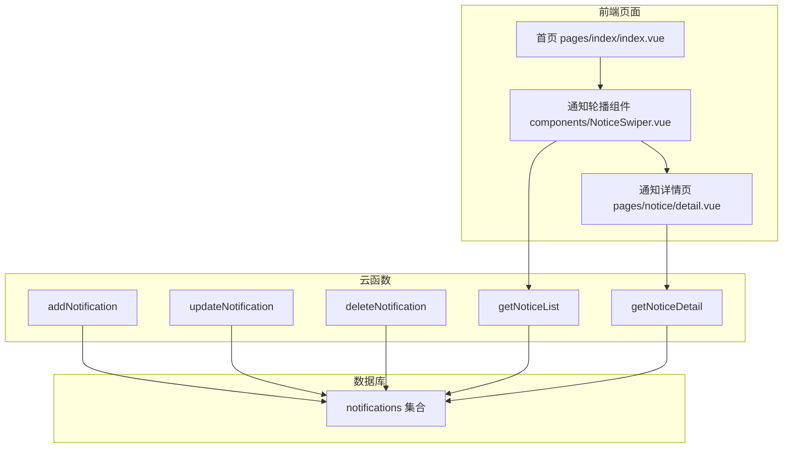
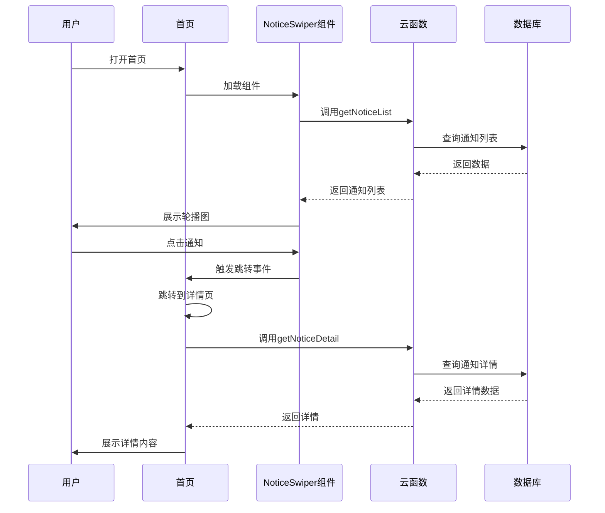

# 通知信息轮播图功能设计方案

## 一、功能概述

在首页顶部导航上方增加通知信息轮播图，用于展示当前的优惠活动和相关通知。用户点击通知可跳转到详情页面查看完整内容。

## 二、系统架构

### 2.1 整体架构图



### 2.2 数据流向



## 三、数据库设计

### 3.1 notifications 集合结构

```json
{
  "_id": "系统自动生成",
  "title": "通知标题",
  "content": "通知详细内容",
  "type": "通知类型 (promotion|announcement|maintenance)",
  "image": "通知图片URL（可选）",
  "linkUrl": "跳转链接（可选）",
  "linkType": "链接类型 (none|page|url|product)",
  "priority": "优先级 (1-10, 数字越大优先级越高)",
  "status": "状态 (active|inactive|expired)",
  "startTime": "开始时间",
  "endTime": "结束时间",
  "sort": "排序值",
  "create_date": "创建时间",
  "update_date": "更新时间"
}
```

### 3.2 字段说明

| 字段名 | 类型 | 必填 | 说明 |
|--------|------|------|------|
| _id | string | 否 | 系统自动生成 |
| title | string | 是 | 通知标题 |
| content | string | 是 | 通知详细内容（支持富文本） |
| type | string | 是 | 通知类型：promotion-促销活动, announcement-公告, maintenance-维护通知 |
| image | string | 否 | 通知图片URL |
| linkUrl | string | 否 | 跳转链接（可以是页面路径或外部URL） |
| linkType | string | 否 | 链接类型：none-不跳转, page-内部页面, url-外部链接, product-产品详情 |
| priority | int | 否 | 优先级1-10，默认为5 |
| status | string | 是 | 状态：active-生效中, inactive-未启用, expired-已过期 |
| startTime | timestamp | 否 | 开始生效时间 |
| endTime | timestamp | 否 | 结束生效时间 |
| sort | int | 否 | 排序值，数字越小越靠前 |
| create_date | timestamp | 否 | 创建时间（自动生成） |
| update_date | timestamp | 否 | 更新时间（自动生成） |

## 四、组件设计

### 4.1 NoticeSwiper.vue 组件

**功能特性：**
- 自动轮播展示通知
- 支持手动滑动切换
- 点击通知跳转到详情页
- 支持不同通知类型的样式区分
- 空状态展示

**Props：**
```typescript
{
  noticeList: Array  // 通知列表数据
  autoplay: Boolean  // 是否自动轮播，默认true
  interval: Number   // 轮播间隔，默认3000ms
}
```

**Events：**
```typescript
{
  click: Function  // 点击通知事件，返回通知对象
}
```

### 4.2 组件样式设计

- 通知轮播区域高度：80-100rpx
- 背景色：根据通知类型区分
  - 促销活动：渐变橙色背景
  - 公告：渐变蓝色背景
  - 维护通知：渐变灰色背景
- 文字颜色：白色
- 支持左右指示器
- 支持圆角设计

## 五、页面设计

### 5.1 通知详情页 (pages/notice/detail.vue)

**页面结构：**
1. 顶部导航栏（返回按钮）
2. 通知标题区
3. 通知类型标签
4. 通知内容区（支持富文本）
5. 通知图片（如果有）
6. 操作按钮区（如：跳转链接按钮）
7. 底部时间信息（发布时间、有效期）

**功能特性：**
- 展示通知完整内容
- 支持富文本渲染
- 支持图片预览
- 根据linkType提供跳转功能

## 六、云函数设计

### 6.1 getNoticeList - 获取通知列表

**功能：** 获取当前生效的通知列表

**参数：**
```javascript
{
  type: string,    // 可选，筛选通知类型
  limit: number,   // 可选，返回数量，默认10
}
```

**返回：**
```javascript
{
  code: 0,
  message: 'success',
  data: {
    notices: [
      {
        _id: 'xxx',
        title: 'xxx',
        content: 'xxx',
        type: 'promotion',
        image: 'xxx',
        linkUrl: 'xxx',
        linkType: 'page',
        priority: 8,
        status: 'active',
        startTime: xxx,
        endTime: xxx,
        sort: 1
      }
    ],
    total: 10
  }
}
```

**查询逻辑：**
1. 筛选 status = 'active'
2. 检查时间有效性（当前时间在 startTime 和 endTime 之间）
3. 按优先级降序、sort升序排序
4. 限制返回数量

### 6.2 getNoticeDetail - 获取通知详情

**功能：** 获取单条通知的详细信息

**参数：**
```javascript
{
  id: string  // 通知ID
}
```

**返回：**
```javascript
{
  code: 0,
  message: 'success',
  data: {
    _id: 'xxx',
    title: 'xxx',
    content: 'xxx',
    type: 'promotion',
    image: 'xxx',
    linkUrl: 'xxx',
    linkType: 'page',
    priority: 8,
    status: 'active',
    startTime: xxx,
    endTime: xxx,
    sort: 1,
    create_date: xxx,
    update_date: xxx
  }
}
```

### 6.3 addNotification - 添加通知（管理端）

**功能：** 添加新的通知

**参数：**
```javascript
{
  title: string,
  content: string,
  type: string,
  image: string,      // 可选
  linkUrl: string,    // 可选
  linkType: string,   // 可选
  priority: number,   // 可选
  status: string,     // 可选
  startTime: timestamp, // 可选
  endTime: timestamp   // 可选
}
```

### 6.4 updateNotification - 更新通知（管理端）

**功能：** 更新现有通知

**参数：**
```javascript
{
  id: string,
  title: string,      // 可选
  content: string,    // 可选
  type: string,       // 可选
  image: string,      // 可选
  linkUrl: string,    // 可选
  linkType: string,   // 可选
  priority: number,   // 可选
  status: string,     // 可选
  startTime: timestamp, // 可选
  endTime: timestamp   // 可选
}
```

### 6.5 deleteNotification - 删除通知（管理端）

**功能：** 删除通知

**参数：**
```javascript
{
  id: string
}
```

## 七、首页集成方案

### 7.1 组件位置

在 [`pages/index/index.vue`](pages/index/index.vue) 中，将通知轮播组件放置在顶部导航栏上方：

```vue
<template>
  <view class="container">
    <!-- 通知轮播图区域 -->
    <NoticeSwiper 
      :noticeList="noticeList" 
      @click="handleNoticeClick"
    />
    
    <!-- 顶部导航 -->
    <view class="header">
      ...
    </view>
    
    <!-- 其他内容 -->
    ...
  </view>
</template>
```

### 7.2 数据加载

在首页的 `onMounted` 中调用 `getNoticeList` 云函数获取通知数据。

### 7.3 点击处理

点击通知后，根据 `linkType` 进行跳转：
- `page`: 跳转到内部页面
- `url`: 打开外部链接
- `product`: 跳转到产品详情页
- `none`: 跳转到通知详情页

## 八、文件结构

```
lxjj-app/
├── components/
│   └── NoticeSwiper.vue           # 通知轮播组件
├── pages/
│   ├── notice/
│   │   └── detail.vue              # 通知详情页
│   └── index/
│       └── index.vue              # 首页（集成通知轮播）
├── uniCloud-aliyun/
│   ├── cloudfunctions/
│   │   ├── getNoticeList/         # 获取通知列表
│   │   ├── getNoticeDetail/       # 获取通知详情
│   │   ├── addNotification/       # 添加通知（管理端）
│   │   ├── updateNotification/    # 更新通知（管理端）
│   │   └── deleteNotification/    # 删除通知（管理端）
│   └── database/
│       ├── notifications.schema.json
│       └── notifications.init_data.json
└── pages.json                      # 路由配置（需更新）
```

## 九、初始化数据示例

```json
[
  {
    "title": "春季大促销活动",
    "content": "全场家具低至7折，限时优惠，不容错过！活动时间：2025年2月1日-2025年2月28日。",
    "type": "promotion",
    "image": "https://example.com/promo.jpg",
    "linkUrl": "/pages/index/index",
    "linkType": "page",
    "priority": 9,
    "status": "active",
    "startTime": 1738368000000,
    "endTime": 1740787200000,
    "sort": 1
  },
  {
    "title": "系统维护通知",
    "content": "系统将于2025年2月15日凌晨2:00-4:00进行维护升级，届时部分功能可能无法使用，请提前做好准备。",
    "type": "maintenance",
    "priority": 8,
    "status": "active",
    "startTime": 1739488000000,
    "endTime": 1740092800000,
    "sort": 2
  },
  {
    "title": "新品上市公告",
    "content": "全新北欧风系列家具现已上市，欢迎进店选购！",
    "type": "announcement",
    "image": "https://example.com/newproduct.jpg",
    "linkUrl": "/pages/case/index",
    "linkType": "page",
    "priority": 7,
    "status": "active",
    "startTime": 1738368000000,
    "endTime": 1743465600000,
    "sort": 3
  }
]
```

## 十、实现步骤

1. 创建数据库schema和初始化数据
2. 创建通知轮播组件
3. 创建通知详情页面
4. 创建云函数（5个）
5. 在首页集成组件
6. 更新路由配置
7. 测试功能

## 十一、扩展功能（可选）

1. 通知管理后台页面
2. 通知点击统计
3. 用户已读/未读状态
4. 通知推送功能
5. 富文本编辑器支持
