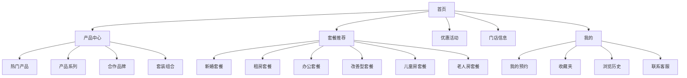

# 家居店微信小程序设计方案

## 一、项目概述

### 1.1 项目背景

为小型本地家具店（1-3家门店）开发微信小程序，主要目标是：

- 展示线下购物的核心优势，与网购形成差异化竞争
- 提供产品展示和套餐推荐
- 建立品牌信任度，吸引客户到店体验
- 提供便捷的预约和咨询服务

### 1.2 目标用户

- 首次购买家具的用户
- 对网购家具不信任，希望亲眼所见材质的用户
- 需要一站式服务（购买、配送、安装、售后）的用户
- 不同生活阶段的客户（新婚、租房、改善型、老人、小孩等）

---

## 二、整体架构设计

### 2.0 核心设计理念

**首页定位**：简洁高效的入口页面，快速引导用户到核心内容

**首页设计原则**：

- 简洁明了，避免信息过载
- 突出核心内容：热门产品、热门套餐、优惠活动
- 快速导航，通过底部导航栏进入其他功能页面
- 线下优势通过产品详情页、套餐详情页、购买流程页等页面体现

### 2.1 页面结构图



### 2.2 底部导航栏设计

| 图标 | 页面名称 | 功能说明                     |
| ---- | -------- | ---------------------------- |
| 🏠   | 首页     | 热门产品、热门套餐、优惠活动 |
| 🛋️   | 产品     | 产品分类、搜索、筛选         |
| 📦   | 套餐     | 不同场景的套餐推荐           |
| 📍   | 门店     | 门店信息、导航、预约         |
| 👤   | 我的     | 个人中心、预约记录、收藏     |

---

## 三、首页模块设计

### 3.1 首页布局结构

```
┌─────────────────────────────────────┐
│         顶部搜索栏 + 定位             │
├─────────────────────────────────────┤
│         轮播图（品牌形象/活动宣传）     │
├─────────────────────────────────────┤
│         🔥 热门产品推荐               │
│  ┌──────────────────────────────┐   │
│  │  [横向滚动产品卡片]           │   │
│  │  ┌──────┐ ┌──────┐ ┌──────┐ │   │
│  │  │产品1 │ │产品2 │ │产品3 │ │   │
│  │  └──────┘ └──────┘ └──────┘ │   │
│  └──────────────────────────────┘   │
│         [查看更多热门产品 →]          │
├─────────────────────────────────────┤
│         📦 热门套餐推荐               │
│  ┌──────────────────────────────┐   │
│  │  [横向滚动套餐卡片]           │   │
│  │  ┌──────────┐ ┌──────────┐  │   │
│  │  │新婚套餐  │ │租房套餐  │  │   │
│  │  │¥45,000  │ │¥12,000  │  │   │
│  │  └──────────┘ └──────────┘  │   │
│  └──────────────────────────────┘   │
│         [查看更多套餐 →]              │
├─────────────────────────────────────┤
│         🎉 当前优惠活动               │
│  ┌──────────────────────────────┐   │
│  │  [活动卡片1]                  │   │
│  │  🔥 新年大促 全场8折起        │   │
│  │  ⏰ 剩余5天                    │   │
│  └──────────────────────────────┘   │
│  ┌──────────────────────────────┐   │
│  │  [活动卡片2]                  │   │
│  │  💕 新婚套餐立减5000元         │   │
│  └──────────────────────────────┘   │
│         [查看更多活动 →]              │
├─────────────────────────────────────┤
│         底部导航栏                    │
└─────────────────────────────────────┘
```

### 3.2 热门产品模块

#### 3.2.1 展示方式

- **横向滚动卡片**：展示6-8款热门产品
- **产品卡片内容**：
  - 产品图片（高质量）
  - 产品名称
  - 产品价格
  - 热销标签（如"本周热销TOP1"）
- **跳转**：点击卡片跳转到产品详情页
- **查看更多**：底部"查看更多热门产品"按钮，跳转到产品中心页面

#### 3.2.2 热门产品筛选标准

- 按销量排序
- 按浏览量排序
- 按好评率排序
- 支持后台手动设置推荐

### 3.3 热门套餐模块

#### 3.3.1 展示方式

- **横向滚动卡片**：展示4-6款热门套餐
- **套餐卡片内容**：
  - 套餐图片（实景图）
  - 套餐名称（如"新婚婚房套餐"）
  - 套餐价格
  - 适用场景标签（如"新婚"、"80-120㎡"）
  - 优惠标签（如"立省¥13,000"）
- **跳转**：点击卡片跳转到套餐详情页
- **查看更多**：底部"查看更多套餐"按钮，跳转到套餐推荐页面

#### 3.3.2 热门套餐筛选标准

- 按销量排序
- 按咨询量排序
- 按好评率排序
- 支持后台手动设置推荐

### 3.4 优惠活动模块

#### 3.4.1 展示方式

- **活动卡片列表**：展示2-3个当前进行的活动
- **活动卡片内容**：
  - 活动海报/图片
  - 活动标题
  - 活动亮点（如"全场8折起"、"立减5000元"）
  - 活动倒计时（如"剩余5天"）
  - 活动标签（如"限时"、"新客专享"）
- **跳转**：点击卡片跳转到活动详情页
- **查看更多**：底部"查看更多活动"按钮，跳转到优惠活动页面

#### 3.4.2 活动展示优先级

- 限时活动优先展示（带倒计时）
- 新客专享活动
- 大型促销活动
- 套装优惠活动

---

## 四、产品中心模块设计

### 4.1 产品中心页面结构

```
┌─────────────────────────────────────┐
│         搜索框 + 筛选按钮             │
├─────────────────────────────────────┤
│    分类标签（横向滚动）               │
│  [全部] [沙发] [床] [餐桌] [衣柜]    │
├─────────────────────────────────────┤
│         筛选条件展开区                │
│  价格区间 | 风格 | 材质 | 尺寸        │
├─────────────────────────────────────┤
│         产品列表（瀑布流）            │
│  ┌──────────┐  ┌──────────┐         │
│  │  产品图片  │  │  产品图片  │         │
│  │  产品名称  │  │  产品名称  │         │
│  │  价格     │  │  价格     │         │
│  │  [详情]   │  │  [详情]   │         │
│  └──────────┘  └──────────┘         │
└─────────────────────────────────────┘
```

### 4.2 产品详情页设计

```
┌─────────────────────────────────────┐
│         产品图片轮播                 │
│         [←]  [→]                     │
├─────────────────────────────────────┤
│  产品名称 + 价格 + 收藏/分享          │
├─────────────────────────────────────┤
│  核心参数标签                        │
│  [材质] [尺寸] [颜色] [风格]          │
├─────────────────────────────────────┤
│  产品详细介绍                        │
│  - 材质说明                          │
│  - 工艺特点                          │
│  - 适用场景                          │
├─────────────────────────────────────┤
│  线下体验优势提醒                    │
│  💡 建议到店实地体验，感受真实质感     │
├─────────────────────────────────────┤
│  相关推荐                            │
├─────────────────────────────────────┤
│  底部操作栏                          │
│  [预约到店] [在线咨询] [加入收藏]    │
└─────────────────────────────────────┘
```

### 4.3 产品分类设计

#### 4.3.1 热门产品

- 展示销量最高、最受欢迎的单品
- 支持按"本周热销"、"本月热销"筛选

#### 4.3.2 产品系列

- 按设计风格分类：现代简约、北欧、新中式、美式、欧式
- 每个系列展示3-5款代表性产品

#### 4.3.3 合作品牌

- 展示合作的知名家具品牌
- 每个品牌展示logo和代表产品

#### 4.3.4 套装组合

- 客厅套装、卧室套装、餐厅套装
- 套装价格优惠提示

---

## 五、客户案例模块设计

### 5.1 客户案例列表页

```
┌─────────────────────────────────────┐
│         客户案例                     │
├─────────────────────────────────────┤
│    筛选标签                          │
│  [全部] [新婚] [租房] [改善型] [儿童] │
├─────────────────────────────────────┤
│  案例卡片列表                        │
│  ┌──────────────────────────────┐   │
│  │  [实景图片]                   │   │
│  │  客户：张先生 & 李女士        │   │
│  │  场景：新婚婚房               │   │
│  │  购买：客厅套装+卧室套装       │   │
│  │  评价：服务周到，质量满意...   │   │
│  │  [查看详情]                   │   │
│  └──────────────────────────────┘   │
└─────────────────────────────────────┘
```

### 5.2 客户案例详情页

```
┌─────────────────────────────────────┐
│         客户案例详情                 │
├─────────────────────────────────────┤
│  客户信息                            │
│  - 客户姓名（可匿名）                │
│  - 购买场景（新婚/租房/改善型等）     │
│  - 购买时间                          │
├─────────────────────────────────────┤
│  实景图片展示（多图轮播）             │
├─────────────────────────────────────┤
│  购买产品清单                        │
│  - 客厅套装（沙发+茶几+电视柜）       │
│  - 卧室套装（床+床头柜+衣柜）         │
├─────────────────────────────────────┤
│  客户评价（带星级）                  │
│  ⭐⭐⭐⭐⭐ 5.0分                     │
│  "服务非常周到，从选品到安装都很..."  │
├─────────────────────────────────────┤
│  服务体验分享                        │
│  - 导购服务体验                      │
│  - 配送安装体验                      │
│  - 售后服务体验                      │
├─────────────────────────────────────┤
│  相关产品推荐                        │
└─────────────────────────────────────┘
```

### 5.3 案例真实性保障

- 展示真实客户照片（经同意）
- 标注"真实案例"标识
- 可展示购买凭证（打码处理）
- 鼓励客户上传自己的案例（有奖励）

---

## 六、门店信息模块设计

### 6.1 门店列表页

```
┌─────────────────────────────────────┐
│         门店列表                     │
├─────────────────────────────────────┤
│  门店卡片（可滑动切换）               │
│  ┌──────────────────────────────┐   │
│  │  [门店图片]                   │   │
│  │  旗舰店 - 朝阳路店            │   │
│  │  📍 北京市朝阳区朝阳路123号    │   │
│  │  📞 010-12345678              │   │
│  │  ⏰ 周一至周日 9:00-21:00     │   │
│  │  [导航] [预约] [电话]         │   │
│  └──────────────────────────────┘   │
├─────────────────────────────────────┤
│  门店特色介绍                        │
│  - 展厅面积：2000㎡                 │
│  - 展示产品：500+款                 │
│  - 服务团队：20人                   │
├─────────────────────────────────────┤
│  门店实景图                          │
├─────────────────────────────────────┤
│  到店预约表单                        │
│  - 选择日期                          │
│  - 选择时间                          │
│  - 选择门店                          │
│  - 预约人数                          │
│  - 联系方式                          │
│  - 需求描述                          │
│  [提交预约]                         │
└─────────────────────────────────────┘
```

### 6.2 门店详情页功能

- **地图导航**：一键导航到门店
- **门店电话**：一键拨打
- **营业时间**：清晰展示
- **门店特色**：展厅规模、产品数量、服务团队
- **到店预约**：在线预约到店时间
- **门店活动**：当前门店专属活动

---

## 七、优惠活动模块设计

### 7.1 优惠活动列表页

```
┌─────────────────────────────────────┐
│         优惠活动                     │
├─────────────────────────────────────┤
│    活动筛选标签                      │
│  [全部] [限时] [套装] [新客] [节日]  │
├─────────────────────────────────────┤
│  活动卡片列表                        │
│  ┌──────────────────────────────┐   │
│  │  [活动海报]                   │   │
│  │  🔥 新年大促                 │   │
│  │  全场家具8折起                │   │
│  │  ⏰ 2024.01.01 - 01.31       │   │
│  │  [查看详情]                   │   │
│  └──────────────────────────────┘   │
└─────────────────────────────────────┘
```

### 7.2 活动详情页

```
┌─────────────────────────────────────┐
│         活动详情                     │
├─────────────────────────────────────┤
│  活动海报                            │
├─────────────────────────────────────┤
│  活动标题 + 剩余时间倒计时           │
├─────────────────────────────────────┤
│  活动规则说明                        │
│  - 活动时间                          │
│  - 参与条件                          │
│  - 优惠力度                          │
│  - 使用说明                          │
├─────────────────────────────────────┤
│  参与产品列表                        │
│  ┌──────────┐  ┌──────────┐         │
│  │  产品图片  │  │  产品图片  │         │
│  │  原价     │  │  原价     │         │
│  │  活动价   │  │  活动价   │         │
│  └──────────┘  └──────────┘         │
├─────────────────────────────────────┤
│  底部操作栏                          │
│  [预约到店] [在线咨询]               │
└─────────────────────────────────────┘
```

### 7.3 活动类型设计

#### 7.3.1 限时优惠

- 节日大促、周年庆、清仓特卖
- 显示倒计时，制造紧迫感

#### 7.3.2 套装优惠

- 购买套装享受折扣
- 套装组合推荐

#### 7.3.3 新客专享

- 首次到店客户专属优惠
- 新人礼包

#### 7.3.4 会员活动

- 会员积分兑换
- 会员专属折扣

---

## 八、购买流程模块设计

### 8.1 购买流程总览页

```
┌─────────────────────────────────────┐
│         购买流程指南                 │
├─────────────────────────────────────┤
│  流程步骤时间轴                      │
│                                     │
│  ┌─────┐    ┌─────┐    ┌─────┐     │
│  │ 1   │ →  │ 2   │ →  │ 3   │     │
│  │到店 │    │选品 │    │测量 │     │
│  │体验 │    │咨询 │    │设计 │     │
│  └─────┘    └─────┘    └─────┘     │
│      ↓          ↓          ↓       │
│  ┌─────┐    ┌─────┐    ┌─────┐     │
│  │ 4   │ →  │ 5   │ →  │ 6   │     │
│  │下单 │    │配送 │    │安装 │     │
│  │付款 │    │上门 │    │调试 │     │
│  └─────┘    └─────┘    └─────┘     │
│      ↓          ↓          ↓       │
│  ┌─────┐    ┌─────┐              │
│  │ 7   │ →  │ 8   │              │
│  │验收 │    │售后 │              │
│  │确认 │    │保障 │              │
│  └─────┘    └─────┘              │
├─────────────────────────────────────┤
│  [查看详细步骤]                     │
└─────────────────────────────────────┘
```

### 8.2 详细步骤说明

#### 步骤1：到店体验

- **时间**：建议预留2-3小时
- **内容**：
  - 浏览展厅，了解产品
  - 体验不同材质和款式
  - 与导购沟通需求
- **提示**：可提前预约，享受一对一服务

#### 步骤2：选品咨询

- **时间**：1-2小时
- **内容**：
  - 根据需求推荐合适产品
  - 详细介绍产品特点和优势
  - 提供专业搭配建议
- **服务**：专业导购一对一服务

#### 步骤3：测量设计

- **时间**：预约后1-3天内上门
- **内容**：
  - 免费上门测量尺寸
  - 根据空间提供摆放方案
  - 出具设计效果图
- **费用**：免费服务

#### 步骤4：下单付款

- **时间**：确认方案后
- **内容**：
  - 确认订单详情
  - 选择付款方式
  - 签订购买合同
- **支付**：支持微信、支付宝、刷卡

#### 步骤5：配送上门

- **时间**：下单后7-15天（根据产品）
- **内容**：
  - 提前电话预约配送时间
  - 专业配送团队上门
  - 负责搬运到指定位置
- **费用**：市区免费，郊区另计

#### 步骤6：安装调试

- **时间**：配送当天或次日
- **内容**：
  - 专业安装师傅上门
  - 按照标准流程安装
  - 调试至最佳状态
  - 清理现场垃圾
- **费用**：免费安装

#### 步骤7：验收确认

- **时间**：安装完成后
- **内容**：
  - 客户现场验收
  - 检查产品质量
  - 确认安装效果
  - 签字确认
- **保障**：不满意可重新调整

#### 步骤8：售后保障

- **服务内容**：
  - 3年质保（核心产品）
  - 终身维护服务
  - 24小时客服响应
  - 免费上门维修
- **联系方式**：客服电话、微信

### 8.3 流程亮点展示

- **透明化**：每个步骤都有明确时间和服务内容
- **可视化**：流程图清晰易懂
- **省心化**：一站式服务，客户无需操心
- **保障化**：每个环节都有质量保障

---

## 九、套餐推荐模块设计

### 9.1 套餐列表页

```
┌─────────────────────────────────────┐
│         套餐推荐                     │
├─────────────────────────────────────┤
│    场景筛选标签（横向滚动）           │
│  [全部] [新婚] [租房] [办公] [改善]  │
│  [儿童] [老人] [单身]                │
├─────────────────────────────────────┤
│  套餐卡片列表                        │
│  ┌──────────────────────────────┐   │
│  │  [套餐图片]                   │   │
│  │  💕 新婚婚房套餐              │   │
│  │  适合：新婚夫妇，80-120㎡      │   │
│  │  包含：客厅+卧室+餐厅          │   │
│  │  原价：¥58,000  活动价：¥45,000 │
│  │  [查看详情] [预约体验]         │   │
│  └──────────────────────────────┘   │
└─────────────────────────────────────┘
```

### 9.2 套餐详情页

```
┌─────────────────────────────────────┐
│         套餐详情                     │
├─────────────────────────────────────┤
│  套装图片轮播                        │
├─────────────────────────────────────┤
│  套餐名称 + 价格 + 优惠信息          │
├─────────────────────────────────────┤
│  适用场景说明                        │
│  - 目标人群                          │
│  - 适合户型                          │
│  - 风格定位                          │
├─────────────────────────────────────┤
│  包含产品清单                        │
│  ┌──────────────────────────────┐   │
│  │ 客厅区：                      │   │
│  │  - 三人布艺沙发 ¥8,000        │   │
│  │  - 茶几 ¥1,500                │   │
│  │  - 电视柜 ¥2,500              │   │
│  │ 卧室区：                      │   │
│  │  - 双人床 ¥5,000              │   │
│  │  - 床头柜 x2 ¥2,000           │   │
│  │  - 衣柜 ¥6,000                │   │
│  │ 餐厅区：                      │   │
│  │  - 餐桌椅套装 ¥4,000          │   │
│  └──────────────────────────────┘   │
├─────────────────────────────────────┤
│  套餐优势                            │
│  ✅ 风格统一，搭配协调                │
│  ✅ 套装购买，价格优惠                │
│  ✅ 一站配齐，省心省力                │
│  ✅ 可根据需求调整                    │
├─────────────────────────────────────┤
│  客户案例                            │
├─────────────────────────────────────┤
│  底部操作栏                          │
│  [预约到店] [在线咨询] [定制方案]    │
└─────────────────────────────────────┘
```

### 9.3 各套餐详细设计

#### 9.3.1 新婚套餐

- **目标人群**：新婚夫妇
- **适合户型**：80-120㎡
- **风格定位**：温馨浪漫、现代简约
- **包含内容**：
  - 客厅：沙发+茶几+电视柜
  - 主卧：床+床头柜+衣柜
  - 次卧：床+床头柜+书桌
  - 餐厅：餐桌椅套装
- **价格区间**：¥35,000 - ¥60,000
- **特色服务**：免费婚房设计咨询

#### 9.3.2 租房套餐

- **目标人群**：租房人群
- **适合户型**：40-80㎡
- **风格定位**：简约实用、性价比高
- **包含内容**：
  - 客厅：简约沙发+茶几
  - 卧室：床+床头柜
  - 餐厅：折叠餐桌椅
- **价格区间**：¥8,000 - ¥15,000
- **特色服务**：可拆卸、易搬运

#### 9.3.3 办公套餐

- **目标人群**：小微企业、SOHO
- **适合户型**：办公室、书房
- **风格定位**：专业、高效
- **包含内容**：
  - 办公桌+办公椅
  - 文件柜
  - 会议桌+椅子
  - 接待沙发
- **价格区间**：¥10,000 - ¥30,000
- **特色服务**：免费空间规划

#### 9.3.4 改善型套餐

- **目标人群**：改善居住环境的家庭
- **适合户型**：100-150㎡
- **风格定位**：品质升级、舒适实用
- **包含内容**：
  - 客厅：升级版沙发+茶几+电视柜
  - 主卧：大床+床头柜+衣柜
  - 次卧：床+床头柜+衣柜
  - 书房：书桌+书柜
  - 餐厅：大尺寸餐桌椅
- **价格区间**：¥50,000 - ¥100,000
- **特色服务**：旧家具回收置换

#### 9.3.5 儿童房套餐

- **目标人群**：有儿童的家庭
- **适合户型**：儿童房（10-20㎡）
- **风格定位**：活泼、安全、环保
- **包含内容**：
  - 儿童床
  - 书桌+椅子
  - 书柜
  - 玩具收纳柜
- **价格区间**：¥8,000 - ¥20,000
- **特色服务**：环保材质认证、安全设计

#### 9.3.6 老人房套餐

- **目标人群**：老年人居住
- **适合户型**：老人房（10-20㎡）
- **风格定位**：舒适、安全、便捷
- **包含内容**：
  - 老人床（高度适中）
  - 床头柜（带扶手）
  - 舒适座椅
  - 收纳柜（低矮设计）
- **价格区间**：¥6,000 - ¥15,000
- **特色服务**：适老化设计、防滑处理

---

## 十、用户交互功能设计

### 10.1 预约到店功能

#### 10.1.1 预约表单

```
┌─────────────────────────────────────┐
│         预约到店                     │
├─────────────────────────────────────┤
│  选择门店                            │
│  [旗舰店 - 朝阳路店 ▼]              │
├─────────────────────────────────────┤
│  选择日期                            │
│  [2024-01-15 ▼]                     │
├─────────────────────────────────────┤
│  选择时间                            │
│  [10:00-12:00 ▼]                    │
├─────────────────────────────────────┤
│  预约人数                            │
│  [2人 ▼]                            │
├─────────────────────────────────────┤
│  联系人信息                          │
│  姓名：[张先生]                      │
│  电话：[138****8888]                 │
├─────────────────────────────────────┤
│  需求描述（选填）                     │
│  [想看看新婚套餐...]                 │
├─────────────────────────────────────┤
│  [提交预约]                         │
└─────────────────────────────────────┘
```

#### 10.1.2 预约确认

- 提交后显示预约成功页面
- 发送短信确认
- 门店提前1天电话提醒

### 10.2 在线咨询功能

#### 10.2.1 咨询方式

- **在线客服**：小程序内置聊天窗口
- **电话咨询**：一键拨打门店电话
- **微信咨询**：添加客服微信

#### 10.2.2 咨询内容分类

- 产品咨询
- 价格咨询
- 套餐咨询
- 预约咨询
- 售后咨询

### 10.3 收藏功能

- 收藏产品
- 收藏套餐
- 收藏案例
- 我的收藏列表

### 10.4 分享功能

- 分享产品给好友
- 分享套餐给好友
- 分享活动给好友
- 生成分享海报

---

## 十一、我的页面设计

### 11.1 我的页面结构

```
┌─────────────────────────────────────┐
│         个人中心                     │
├─────────────────────────────────────┤
│  用户信息                            │
│  [头像]  张先生                      │
│         138****8888                  │
├─────────────────────────────────────┤
│  我的订单/预约                        │
│  ┌──────────────────────────────┐   │
│  │  📋 我的预约 (3)              │   │
│  │  📦 我的订单 (2)              │   │
│  └──────────────────────────────┘   │
├─────────────────────────────────────┤
│  我的收藏                            │
│  ┌──────────────────────────────┐   │
│  │  ❤️ 收藏的产品 (12)           │   │
│  │  📦 收藏的套餐 (5)            │   │
│  │  🏠 收藏的案例 (3)            │   │
│  └──────────────────────────────┘   │
├─────────────────────────────────────┤
│  浏览历史                            │
│  ┌──────────────────────────────┐   │
│  │  👁️ 最近浏览                 │   │
│  └──────────────────────────────┘   │
├─────────────────────────────────────┤
│  客户服务                            │
│  ┌──────────────────────────────┐   │
│  │  📞 联系客服                 │   │
│  │  💬 在线咨询                 │   │
│  │  📍 门店导航                 │   │
│  │  ❓ 常见问题                 │   │
│  └──────────────────────────────┘   │
├─────────────────────────────────────┤
│  关于我们                            │
│  ┌──────────────────────────────┐   │
│  │  ℹ️ 品牌介绍                 │   │
│  │  📱 联系方式                 │   │
│  │  ⭐ 给我们评分               │   │
│  └──────────────────────────────┘   │
└─────────────────────────────────────┘
```

---

## 十二、技术实现建议

### 12.1 技术栈选择

- **前端框架**：微信小程序原生开发或 uni-app
- **后端**：云开发（微信云开发）或自建服务器
- **数据库**：云数据库或 MySQL
- **图片存储**：云存储（七牛云、阿里云OSS）
- **地图服务**：腾讯地图 API

### 12.2 核心功能模块

#### 12.2.1 数据管理

- 产品数据管理
- 套餐数据管理
- 案例数据管理
- 门店数据管理
- 活动数据管理
- 用户数据管理

#### 12.2.2 预约系统

- 在线预约功能
- 预约管理后台
- 预约提醒功能

#### 12.2.3 内容管理

- 轮播图管理
- 产品上下架
- 活动发布
- 案例审核

### 12.3 后台管理系统

建议开发一个简单的后台管理系统，用于：

- 产品管理（增删改查）
- 套餐管理
- 案例管理
- 门店管理
- 活动管理
- 预约管理
- 数据统计

---

## 十三、运营建议

### 13.1 内容运营

#### 13.1.1 定期更新

- 每周更新热门产品
- 每月更新客户案例
- 定期发布优惠活动

#### 13.1.2 优质内容

- 高质量产品图片
- 详细的客户案例
- 专业的产品介绍

### 13.2 用户运营

#### 13.2.1 会员体系

- 注册即送优惠券
- 邀请好友奖励
- 消费积分兑换

#### 13.2.2 活动运营

- 节日促销活动
- 新品发布活动
- 会员专属活动

### 13.3 数据分析

- 浏览量统计
- 预约量统计
- 转化率分析
- 用户行为分析

---

## 十四、开发优先级建议

### 第一阶段（核心功能）

1. 首页（热门产品、热门套餐、优惠活动）
2. 产品中心（产品展示）
3. 门店信息（门店展示）
4. 预约功能（在线预约）

### 第二阶段（增强功能）

5. 套餐推荐（套餐展示）
6. 客户案例（案例展示）
7. 优惠活动（活动展示）
8. 购买流程（流程展示）

### 第三阶段（完善功能）

9. 个人中心（用户中心）
10. 在线咨询（客服功能）
11. 收藏分享（社交功能）
12. 后台管理（管理后台）

---

## 十五、总结

本设计方案为小型本地家具店（1-3家门店）提供了一个完整的微信小程序架构，重点突出线下购物的核心优势：

1. **亲眼所见**：强调实地体验的重要性
2. **一站式服务**：从选品到售后的全流程服务
3. **售后无忧**：完善的售后保障体系

通过产品展示、套餐推荐、客户案例、门店信息、优惠活动、购买流程等模块，全面展示家具店的优势，吸引客户到店体验，最终实现转化。

建议按照开发优先级分阶段实施，先完成核心功能，再逐步完善其他功能，确保项目顺利上线。
